<div align="center">
  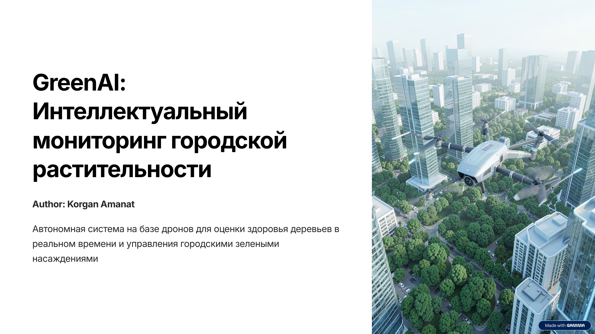
  <h1>GreenAI · PlantVision AI</h1>
  <p><strong>Локальный компьютерный анализ городской растительности по кадрам с камеры или БПЛА</strong></p>
  <p>FastAPI · WebSocket · Python · обработка на устройстве</p>
</div>

## О проекте

PlantVision AI — исследовательский прототип для наблюдения за городской растительностью. Он принимает изображения с наземных камер или БПЛА и формирует предварительное наблюдение о растительном покрове. GreenAI — концепция более широкой системы мониторинга зелёных зон и ухода за ними; слайды ниже описывают её сценарии, аудиторию и предполагаемую ценность.

Сейчас в проекте есть локальная демо-оценка зелёного покрытия, веб-интерфейс загрузки изображения, REST API и WebSocket для кадров. Подключение валидированных моделей для определения вида и состояния растений остаётся следующим этапом. Без них приложение явно возвращает `unavailable` и `REQUIRES_REVIEW`, а не выдаёт неподтверждённый диагноз.

## Возможности прототипа

- анализ загруженного изображения и потоковых JPEG-кадров;
- оценка доли растительного покрова и его ограничивающей рамки;
- веб-интерфейс, FastAPI endpoint и WebSocket для интеграции;
- предусмотренный адаптер локальной TorchScript-модели классификации вида;
- локальная обработка без обязательной отправки кадров во внешнее облако.

> Демо-оценка по зелёным пикселям не распознаёт вид и не диагностирует здоровье растения. Целевые показатели и экономические оценки в презентации — проектные гипотезы, а не результаты независимых испытаний.

## Запуск

Для камеры на macOS с Python 3.13:

```bash
python3.13 -m venv .venv
source .venv/bin/activate
pip install -e '.[camera]'
plantvision-camera
```

Для веб-сервиса и интерфейса:

```bash
pip install -e .
uvicorn app.main:app --reload
```

Откройте `http://127.0.0.1:8000`. API принимает изображение через `POST /api/v1/analyze`, потоковый интерфейс доступен на `/api/v1/stream`.

## Презентация GreenAI

Ниже — слайды о проблеме ручного мониторинга, предлагаемом процессе, технологиях, аудитории, бизнес-модели, экономических ожиданиях и дорожной карте.

<table>
<tr>
<td align="center"><a href="presentation/slides/slide-1.png"></a><br>01 · GreenAI</td>
<td align="center"><a href="presentation/slides/slide-2.png">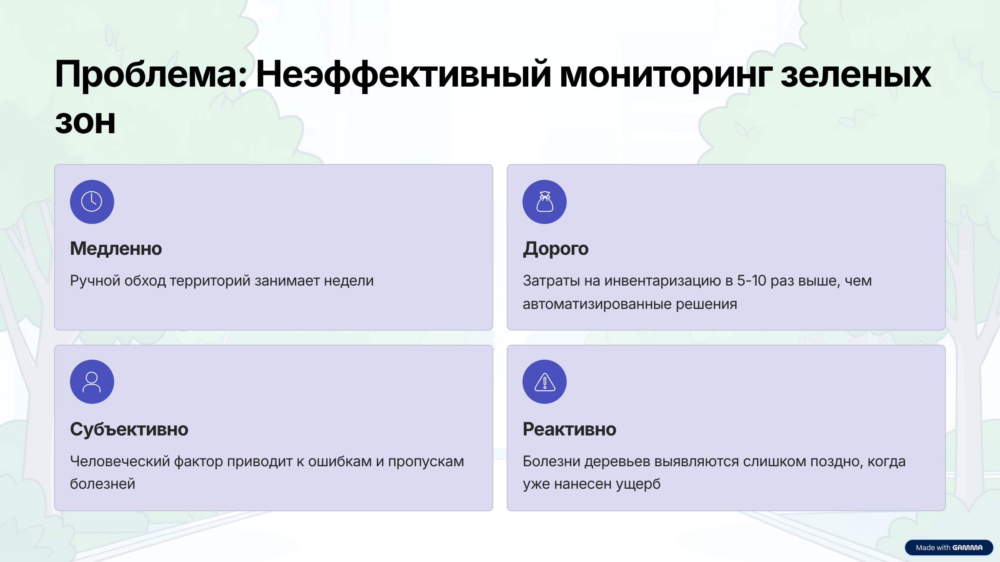</a><br>02 · Проблема</td>
</tr><tr>
<td align="center"><a href="presentation/slides/slide-3.png">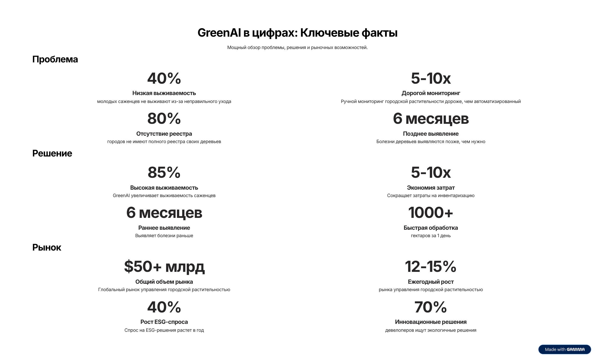</a><br>03 · GreenAI в цифрах</td>
<td align="center"><a href="presentation/slides/slide-4.png">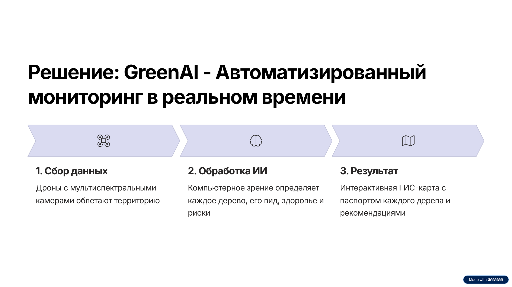</a><br>04 · Решение</td>
</tr><tr>
<td align="center"><a href="presentation/slides/slide-5.png">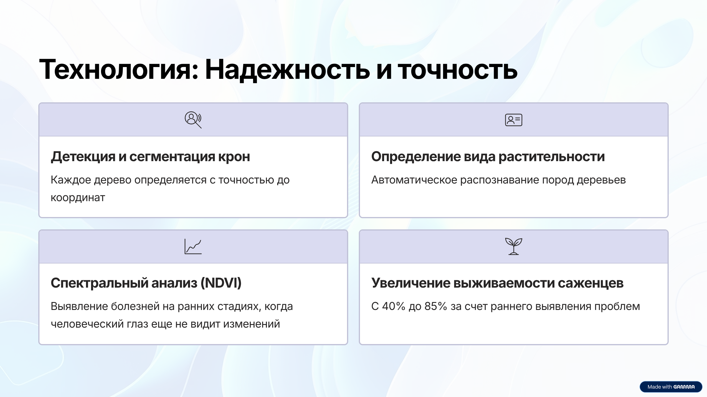</a><br>05 · Технология</td>
<td align="center"><a href="presentation/slides/slide-6.png">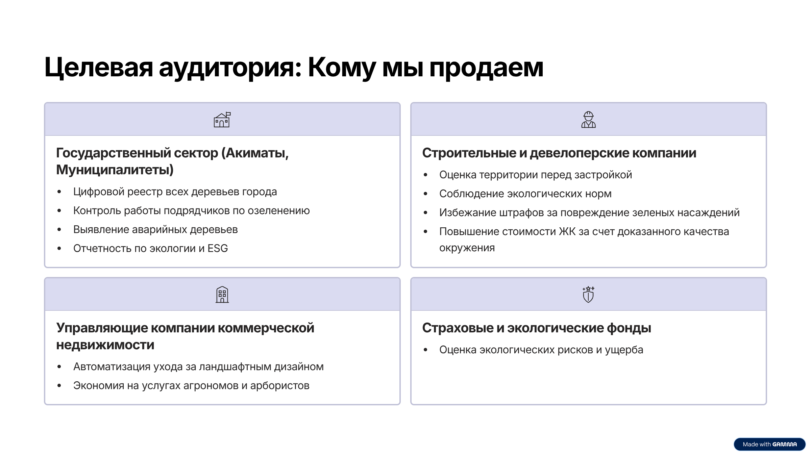</a><br>06 · Целевая аудитория</td>
</tr><tr>
<td align="center"><a href="presentation/slides/slide-7.png">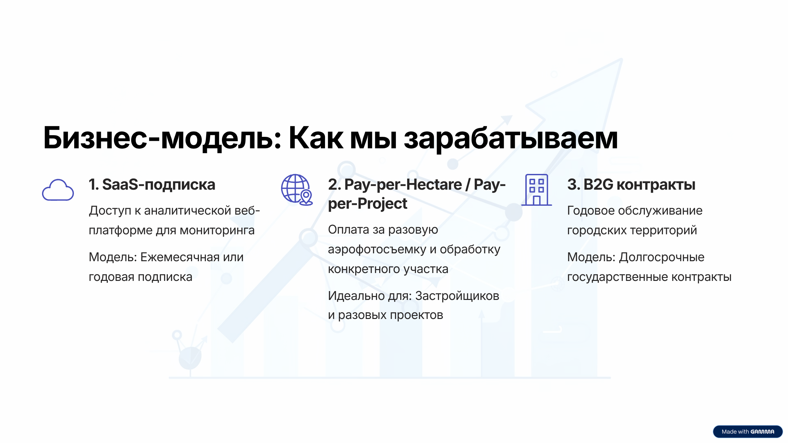</a><br>07 · Бизнес-модель</td>
<td align="center"><a href="presentation/slides/slide-8.png">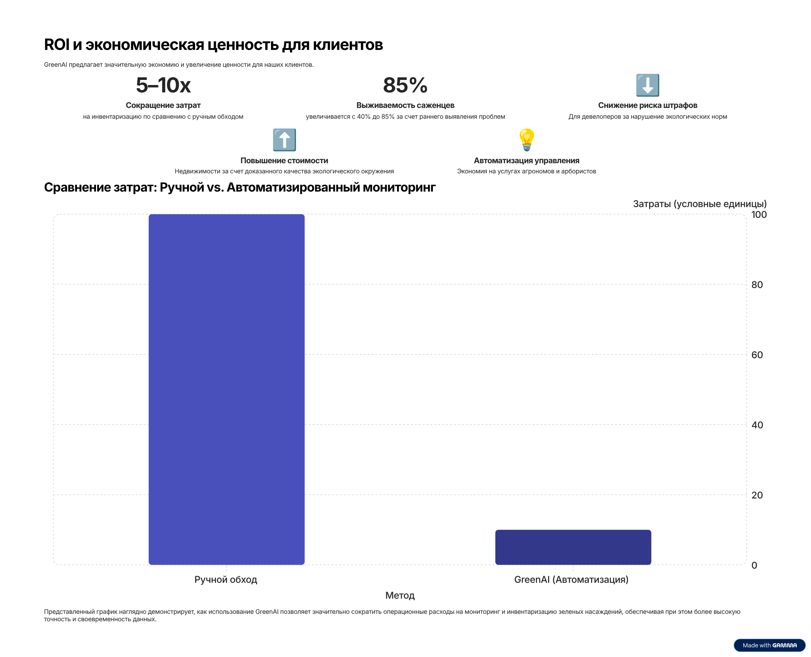</a><br>08 · ROI и ценность</td>
</tr><tr>
<td align="center"><a href="presentation/slides/slide-9.png">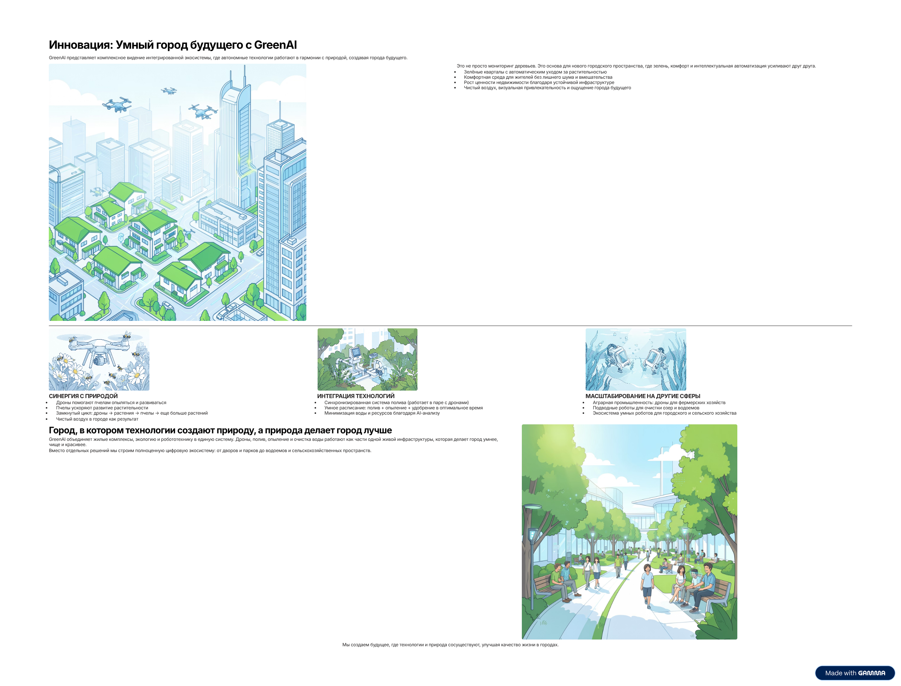</a><br>09 · Умный город</td>
<td align="center"><a href="presentation/slides/slide-10.png">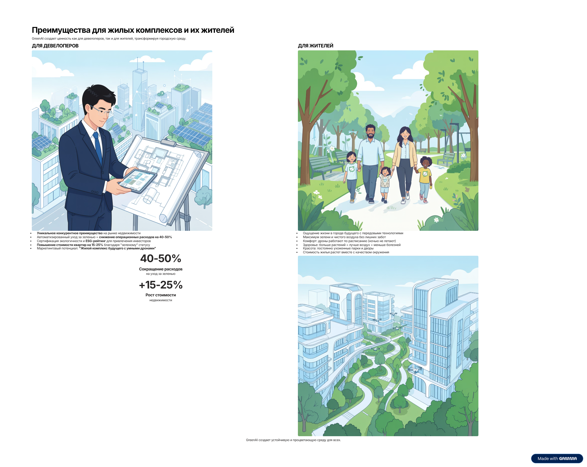</a><br>10 · Для жилых комплексов</td>
</tr><tr>
<td align="center"><a href="presentation/slides/slide-11.png">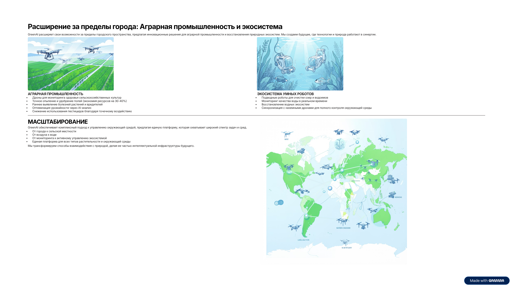</a><br>11 · За пределами города</td>
<td align="center"><a href="presentation/slides/slide-12.png">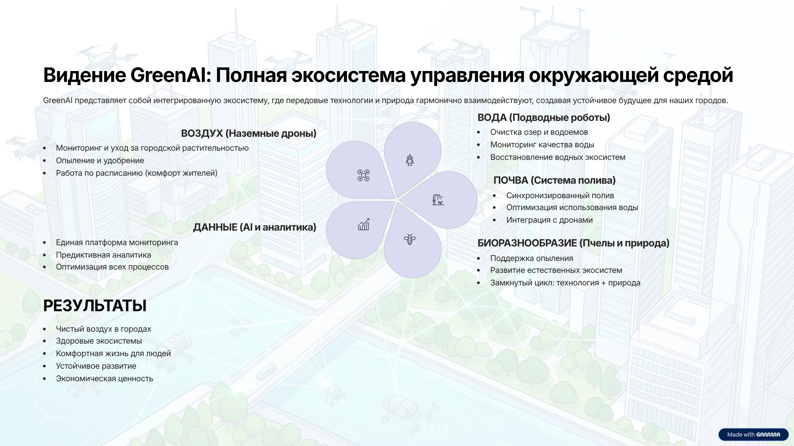</a><br>12 · Экосистема GreenAI</td>
</tr><tr>
<td align="center"><a href="presentation/slides/slide-13.png">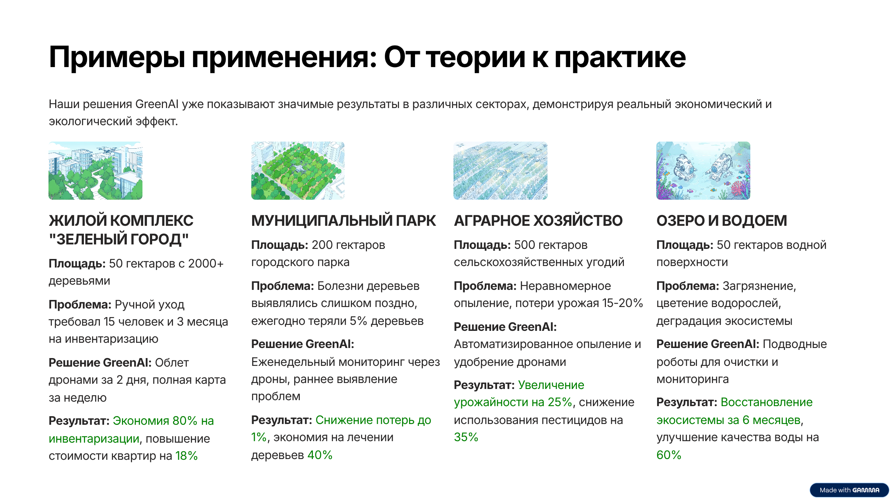</a><br>13 · Примеры применения</td>
<td align="center"><a href="presentation/slides/slide-14.png">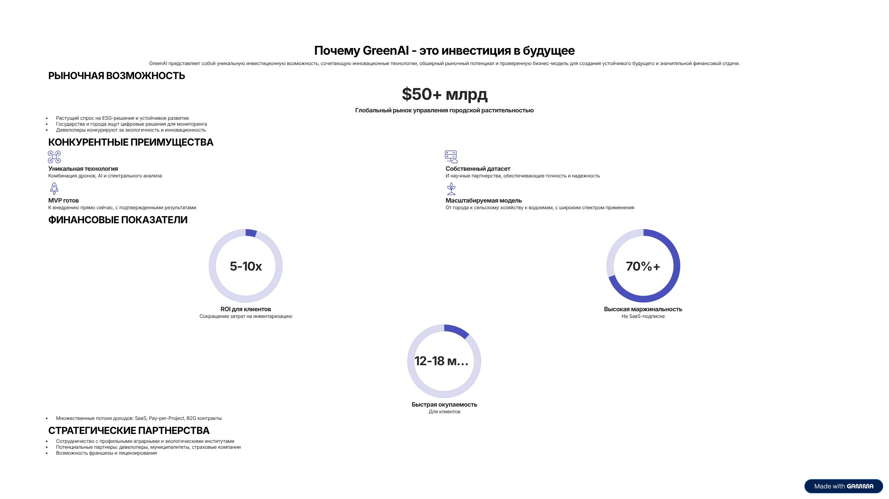</a><br>14 · Инвестиция в будущее</td>
</tr><tr>
<td align="center"><a href="presentation/slides/slide-15.png">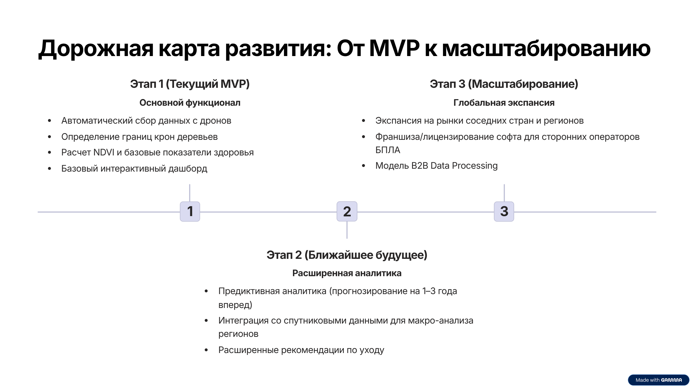</a><br>15 · Дорожная карта</td>
<td align="center"><a href="presentation/slides/slide-16.png">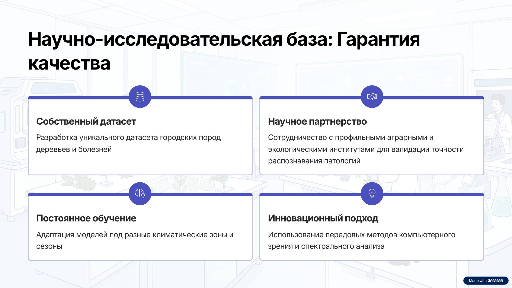</a><br>16 · Научная база</td>
</tr><tr>
<td align="center"><a href="presentation/slides/slide-17.png">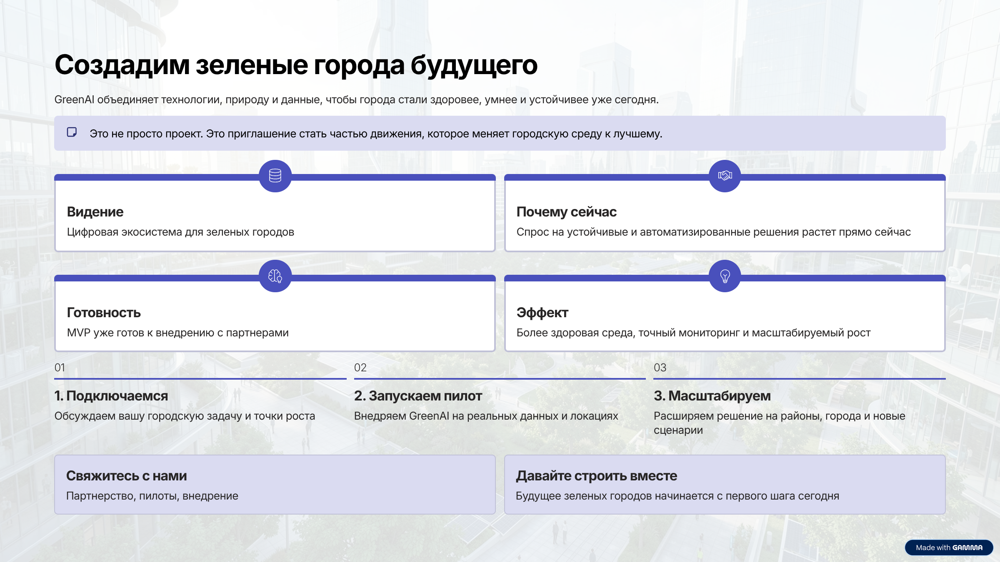</a><br>17 · Создадим зелёные города</td>
<td align="center"><a href="presentation/slides/slide-18.png">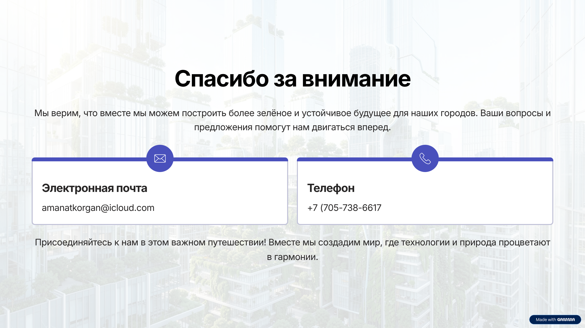</a><br>18 · Спасибо</td>
</tr>
</table>

## Документы

- [Краткое описание проекта](docs/PROJECT_BRIEF_RU.md)
- [Исследовательский отчёт (PDF)](docs/PlantVision_AI_НИР_отчёт.pdf)

## Технические детали

- REST: `POST /api/v1/analyze` — изображение в `multipart/form-data`, поле `image`.
- WebSocket: `ws://127.0.0.1:8000/api/v1/stream` — JPEG в бинарном сообщении, JSON-наблюдение в ответ.
- TorchScript-классификатор вида можно подключить после проверки весов и списка классов; до этого ответ остаётся `unavailable`.

Подробности контракта, настройки модели и следующих исследовательских шагов приведены в [кратком описании](docs/PROJECT_BRIEF_RU.md) и в приложении.
